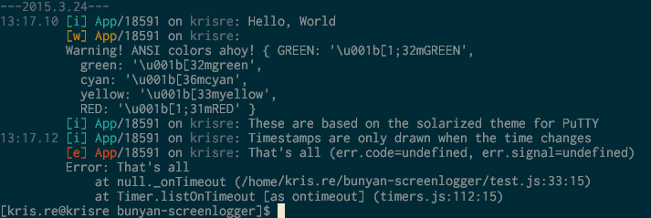

# Bunyan-screenlogger

A simple logger made for cleaner screen output. No dependencies.

## Usage

    var BunyanScreenlogger = require('bunyan-screenlogger');
	
	var stream = new BunyanScreenlogger({
		color: true,
		outputMode: 'long'
	});

	stream.pipe(process.stdout);

	var log = bunyan.createLogger({
		name: 'app',
		streams: [ {
			type: 'raw',
			level: 'trace',
			stream: stream
		} ]
	});

The API is a bit obtuse to use on its own like this, but this is really just a supporting module anyway.

'color' is what it sounds like, a boolean
'outputMode' is as in Bunyan's own logger, which this is a modified copy of. Only 'long' mode actually does anything differently.

## Sample output

